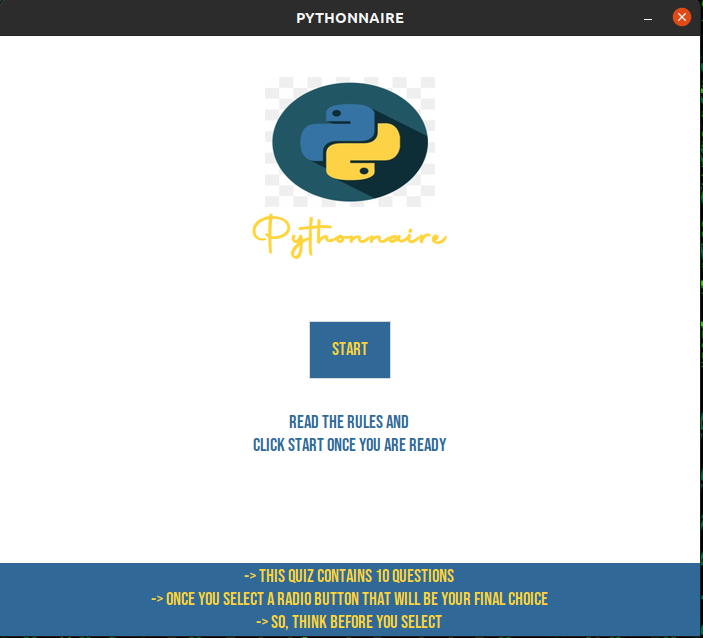
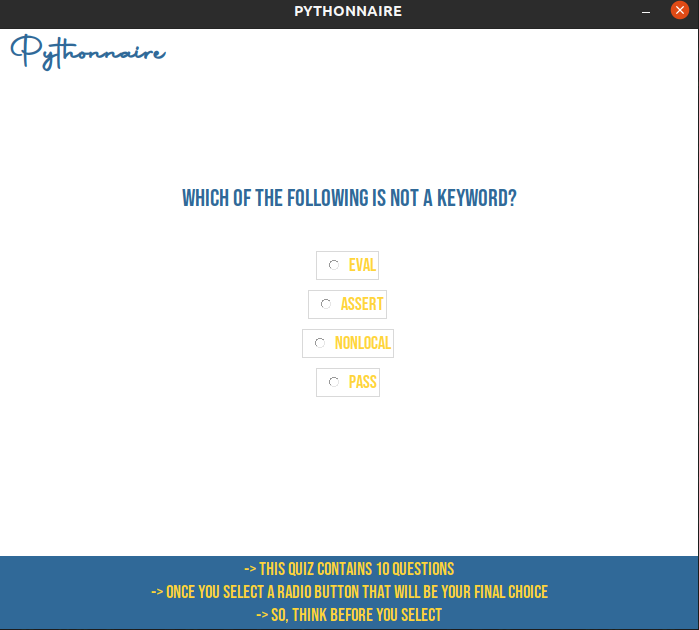
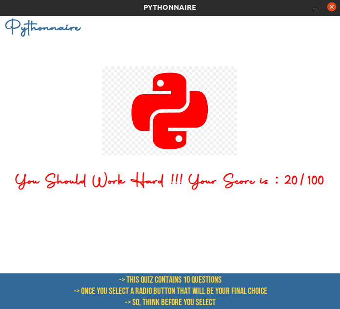

#**PYTHONNAIRE DOCUMENTATION**
##*A Simple Quiz App*

### Programming Language Used
- Python
### Python Modules Used
- json
- tkinter
- pillow
- random

A simple single page quiz app developed using above mentioned programming language and modules.This app demonstrates all basic programming concepts such as variables , control structures , loops , data structures of python (List,Dictionary) , file handling , handling json data etc. This app contains a simple UI and a simple backend.


### App Screenshots





### Installing Modules for Linux/Mac
```bash
sudo apt-get install python3-tk
sudo apt-get install python3-pil python3-pil.imagetk
pip3 install pillow

```
### Installing Modules for Windows
```batch
pip install pillow

```
### Installing Fonts
Please install the Fonts provided in the project folder for a better Looking Ui.
- Autography.otf
- BebasNeue-Regular.ttf

### Code

*Importing the required modules*

```python

import json
import tkinter
from tkinter import *
from PIL import ImageTk, Image
import random

```
*Reading multiple choice questions from data.json file and storing the questions and answers of the questions in 2 different lists . Defining an empty list to store the answers that the user will choose.*
```python
with open('data.json', encoding="utf8") as f:
    data = json.load(f)
questions = [v for v in data[0].values()]
answers_choice = [v for v in data[1].values()]
answers = [0,3,3,1,0,0,3,0,1,1,3,0,0,2,3,2,2,3,2,0] 
user_answer = []
```
*Function which will generate 10 random numbers which will then be used to display random questions from the data.json file*
```python
indexes = []
def gen():
    global indexes
    while(len(indexes) < 10):
        x = random.randint(0,19)
        if x in indexes:
            continue
        else:
            indexes.append(x)
```
*Creating the GUI application main window with basic configurations*
```python
root = tkinter.Tk()
root.title("PYTHONNAIRE")
root.geometry("700x600")
root.config(background="#ffffff")
root.resizable(0,0)
```

**Front Page UI**
*Displaying Logo on the Front Page*
```python
img1=Image.open("Logo.png")
img1=img1.resize((170,130), Image.ANTIALIAS)
img1 = ImageTk.PhotoImage(img1)

labelimage = Label(
    root,
    image = img1,
    background = "#ffffff",
)
labelimage.pack(pady=(40,0))
```
*Displaying the name of the App*
```python
labeltext = Label(
    root,
    text = "Pythonnaire",
    font = ("Autography",30,"bold"),
    background = "#ffffff",
    foreground="#FFD43B"
)
labeltext.pack(pady=(0,50))
```
*Displaying the Start Button*
```python
btnStart = Button(
    root,
    text = 'START',
    height = 2, 
    width = 8,
    border = 0,
    background = "#306998",
    foreground = "#FFD43B",
    activebackground="#FFD43B", 
    activeforeground="#306998",
    font = ("Bebas Neue",14),
    command = startIspressed,
)
btnStart.pack()
```
*Displaying the Label text after the button*
```python
lblInstruction = Label(
    root,
    text = "Read The Rules And\nClick Start Once You Are ready",
    background = "#ffffff",
    foreground="#306998",
    font = ("Bebas Neue",14),
    justify = "center",
)
lblInstruction.pack(pady=(30,104))

```
*Displaying the Rules*
```python
lblRules = Label(
    root,
    text = "-> This quiz contains 10 questions\n-> Once you select a radio button that will be your final choice\n-> So, think before you select",
    width = 100,
    font = ("Bebas Neue",14),
    background = "#306998",
    foreground = "#FFD43B",
)
lblRules.pack()
```
*Entering the main event loop to take action against each event triggered by the user*
```python
root.mainloop()
```
**Backend and Other UI Elements**
*Function which will be called when start button is pressed it will destroy all the widgets present on the front page*
```python
def startIspressed():
    labelimage.destroy()
    labeltext.destroy()
    lblInstruction.destroy()
    lblRules.destroy()
    btnStart.destroy()
    gen()
    startquiz()
```
*Function which will start the quiz*
```python

```

*Function will start the quiz and will also create the second page Ui elements in which random 10 multiple choice questions will be displayed*
```python
def startquiz():
    global lblQuestion,r1,r2,r3,r4
    labeltext = Label(
    root,
    text = "Pythonnaire",
    font = ("Autography",25,"bold"),
    background = "#ffffff",
    foreground="#306998"
    )
    labeltext.pack(anchor="w",padx=10)
    
    lblQuestion = Label(
        root,
        text = questions[indexes[0]],
        font = ("Bebas Neue", 18),
        width = 500,
        justify = "center",
        wraplength = 400,
        background = "#ffffff",
        foreground="#306998"
    )
    lblQuestion.pack(pady=(100,30))

    global radiovar
    radiovar = IntVar()
    radiovar.set(-1)

    r1 = Radiobutton(
        root,
        text = answers_choice[indexes[0]][0],
        font = ("Bebas Neue", 14),
        value = 0,
        variable = radiovar,
        command = selected,
        background = "#ffffff",
        foreground="#FFD43B"
    )
    r1.pack(pady=5)

    r2 = Radiobutton(
        root,
        text = answers_choice[indexes[0]][1],
        font = ("Bebas Neue", 14),
        value = 1,
        variable = radiovar,
        command = selected,
        background = "#ffffff",
        foreground="#FFD43B"
    )
    r2.pack(pady=5)

    r3 = Radiobutton(
        root,
        text = answers_choice[indexes[0]][2],
        font = ("Bebas Neue", 14),
        value = 2,
        variable = radiovar,
        command = selected,
        background = "#ffffff",
        foreground="#FFD43B"
    )
    r3.pack(pady=5)

    r4 = Radiobutton(
        root,
        text = answers_choice[indexes[0]][3],
        font = ("Bebas Neue", 14),
        value = 3,
        variable = radiovar,
        command = selected,
        background = "#ffffff",
        foreground="#FFD43B"
    )
    r4.pack(pady=5)
    lblRules = Label(
    root,
    text = "-> This quiz contains 10 questions\n-> Once you select a radio button that will be your final choice\n-> So, think before you select",
    width = 100,
    font = ("Bebas Neue",14),
    background = "#306998",
    foreground = "#FFD43B",
    )
    lblRules.place(relx = 0.0,
                 rely = 1.0,
                 anchor ='sw')

```
*Function will select a multiple choice question and will give it to the start quiz function to display *
```python
ques = 1
def selected():
    global radiovar,user_answer
    global lblQuestion,r1,r2,r3,r4
    global ques
    x = radiovar.get()
    user_answer.append(x)
    radiovar.set(-1)
    if ques < 10:
        lblQuestion.config(text= questions[indexes[ques]])
        r1['text'] = answers_choice[indexes[ques]][0]
        r2['text'] = answers_choice[indexes[ques]][1]
        r3['text'] = answers_choice[indexes[ques]][2]
        r4['text'] = answers_choice[indexes[ques]][3]
        ques += 1
    else:
        calc()
```
*Function will calculate the score of the user*
```python
def calc():
    global indexes,user_answer,answers
    x = 0
    global score
    score = 0
    for i in indexes:
        if user_answer[x] == answers[i]:
            score = score + 10
        x += 1
    print(score)
    showresult(score)
```
*Function will display the Result of the user and will also create result page UI elements *
```python
def showresult(score):
    lblQuestion.destroy()
    r1.destroy()
    r2.destroy()
    r3.destroy()
    r4.destroy()
    labelimage = Label(
        root,
        background = "blue",
        border = 0,
    )
    labelimage.pack(pady=(50,30))
    labelresulttext = Label(
        root,
        font = ("Bebas Neue",20),
        background = "#ffffff",
    )
    labelresulttext.pack()
    if score >= 80:
        img = PhotoImage(file="great.png")
        labelimage.configure(image=img)
        labelimage.image = img
        labelresulttext.configure(text=f"Excellent !!! Your Score is : {score}/100",background = "#ffffff",
        foreground="green",font = ("Autography",24,"bold"),)
    elif (score >= 50 and score < 80):
        img = PhotoImage(file="ok.png")
        labelimage.configure(image=img)
        labelimage.image = img
        labelresulttext.configure(text=f"You Can Be Better !!! Your Score is : {score}/100",background = "#ffffff",
        foreground="#FFD43B",font = ("Autography",24,"bold"),)
    else:
        img = PhotoImage(file="bad.png")
        labelimage.image = img
        labelimage.configure(image=img)
        labelresulttext.configure(text=f"You Should Work Hard !!! Your Score is : {score}/100",background = "#ffffff",
        foreground="Red",font = ("Autography",24,"bold"),)
```
### Full Pythonnaire App Source Code
```python
import json
import tkinter
from tkinter import *
from PIL import ImageTk, Image
import random


with open('data.json', encoding="utf8") as f:
    data = json.load(f)


questions = [v for v in data[0].values()]
answers_choice = [v for v in data[1].values()]

answers = [0,3,3,1,0,0,3,0,1,1,3,0,0,2,3,2,2,3,2,0] 

user_answer = []

indexes = []
def gen():
    global indexes
    while(len(indexes) < 10):
        x = random.randint(0,19)
        if x in indexes:
            continue
        else:
            indexes.append(x)


def showresult(score):
    lblQuestion.destroy()
    r1.destroy()
    r2.destroy()
    r3.destroy()
    r4.destroy()
    labelimage = Label(
        root,
        background = "blue",
        border = 0,
    )
    labelimage.pack(pady=(50,30))
    labelresulttext = Label(
        root,
        font = ("Bebas Neue",20),
        background = "#ffffff",
    )
    labelresulttext.pack()
    if score >= 80:
        img = PhotoImage(file="great.png")
        labelimage.configure(image=img)
        labelimage.image = img
        labelresulttext.configure(text=f"Excellent !!! Your Score is : {score}/100",background = "#ffffff",
        foreground="green",font = ("Autography",24,"bold"),)
    elif (score >= 50 and score < 80):
        img = PhotoImage(file="ok.png")
        labelimage.configure(image=img)
        labelimage.image = img
        labelresulttext.configure(text=f"You Can Be Better !!! Your Score is : {score}/100",background = "#ffffff",
        foreground="#FFD43B",font = ("Autography",24,"bold"),)
    else:
        img = PhotoImage(file="bad.png")
        labelimage.image = img
        labelimage.configure(image=img)
        labelresulttext.configure(text=f"You Should Work Hard !!! Your Score is : {score}/100",background = "#ffffff",
        foreground="Red",font = ("Autography",24,"bold"),)


def calc():
    global indexes,user_answer,answers
    x = 0
    global score
    score = 0
    for i in indexes:
        if user_answer[x] == answers[i]:
            score = score + 10
        x += 1
    # print(score)
    showresult(score)


ques = 1
def selected():
    global radiovar,user_answer
    global lblQuestion,r1,r2,r3,r4
    global ques
    x = radiovar.get()
    user_answer.append(x)
    radiovar.set(-1)
    if ques < 10:
        lblQuestion.config(text= questions[indexes[ques]])
        r1['text'] = answers_choice[indexes[ques]][0]
        r2['text'] = answers_choice[indexes[ques]][1]
        r3['text'] = answers_choice[indexes[ques]][2]
        r4['text'] = answers_choice[indexes[ques]][3]
        ques += 1
    else:
        calc()
    


def startquiz():
    global lblQuestion,r1,r2,r3,r4
    labeltext = Label(
    root,
    text = "Pythonnaire",
    font = ("Autography",25,"bold"),
    background = "#ffffff",
    foreground="#306998"
    )
    labeltext.pack(anchor="w",padx=10)
    
    lblQuestion = Label(
        root,
        text = questions[indexes[0]],
        font = ("Bebas Neue", 18),
        width = 500,
        justify = "center",
        wraplength = 400,
        background = "#ffffff",
        foreground="#306998"
    )
    lblQuestion.pack(pady=(100,30))

    global radiovar
    radiovar = IntVar()
    radiovar.set(-1)

    r1 = Radiobutton(
        root,
        text = answers_choice[indexes[0]][0],
        font = ("Bebas Neue", 14),
        value = 0,
        variable = radiovar,
        command = selected,
        background = "#ffffff",
        foreground="#FFD43B"
    )
    r1.pack(pady=5)

    r2 = Radiobutton(
        root,
        text = answers_choice[indexes[0]][1],
        font = ("Bebas Neue", 14),
        value = 1,
        variable = radiovar,
        command = selected,
        background = "#ffffff",
        foreground="#FFD43B"
    )
    r2.pack(pady=5)

    r3 = Radiobutton(
        root,
        text = answers_choice[indexes[0]][2],
        font = ("Bebas Neue", 14),
        value = 2,
        variable = radiovar,
        command = selected,
        background = "#ffffff",
        foreground="#FFD43B"
    )
    r3.pack(pady=5)

    r4 = Radiobutton(
        root,
        text = answers_choice[indexes[0]][3],
        font = ("Bebas Neue", 14),
        value = 3,
        variable = radiovar,
        command = selected,
        background = "#ffffff",
        foreground="#FFD43B"
    )
    r4.pack(pady=5)
    lblRules = Label(
    root,
    text = "-> This quiz contains 10 questions\n-> Once you select a radio button that will be your final choice\n-> So, think before you select",
    width = 100,
    font = ("Bebas Neue",14),
    background = "#306998",
    foreground = "#FFD43B",
    )
    lblRules.place(relx = 0.0,
                 rely = 1.0,
                 anchor ='sw')


def startIspressed():
    labelimage.destroy()
    labeltext.destroy()
    lblInstruction.destroy()
    lblRules.destroy()
    btnStart.destroy()
    gen()
    startquiz()


root = tkinter.Tk()
root.title("PYTHONNAIRE")
root.geometry("700x600")
root.config(background="#ffffff")
root.resizable(0,0)


img1=Image.open("Logo.png")
img1=img1.resize((170,130), Image.ANTIALIAS)
img1 = ImageTk.PhotoImage(img1)

labelimage = Label(
    root,
    image = img1,
    background = "#ffffff",
)
labelimage.pack(pady=(40,0))

labeltext = Label(
    root,
    text = "Pythonnaire",
    font = ("Autography",30,"bold"),
    background = "#ffffff",
    foreground="#FFD43B"
)
labeltext.pack(pady=(0,50))


btnStart = Button(
    root,
    text = 'START',
    height = 2, 
    width = 8,
    border = 0,
    background = "#306998",
    foreground = "#FFD43B",
    activebackground="#FFD43B", 
    activeforeground="#306998",
    font = ("Bebas Neue",14),
    command = startIspressed,
)
btnStart.pack()

lblInstruction = Label(
    root,
    text = "Read The Rules And\nClick Start Once You Are ready",
    background = "#ffffff",
    foreground="#306998",
    font = ("Bebas Neue",14),
    justify = "center",
)
lblInstruction.pack(pady=(30,104))

lblRules = Label(
    root,
    text = "-> This quiz contains 10 questions\n-> Once you select a radio button that will be your final choice\n-> So, think before you select",
    width = 100,
    font = ("Bebas Neue",14),
    background = "#306998",
    foreground = "#FFD43B",
)
lblRules.pack()

root.mainloop()
```

### Command for Running the App in Linux/Mac
```bash
python3 Pythonnaire.py
```

### Command for Running the App in Windows
- You can also run the App by double clicking the Pythonnaire.py file
```batch
python Pythonnaire.py

```

### Developed by
**Hamad Saqib**
### Seat No
**B20102045**


